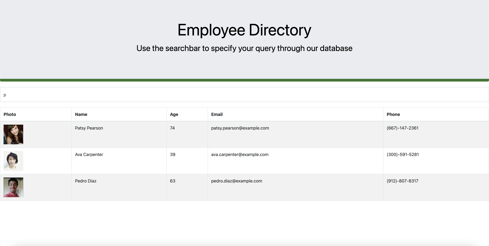

# Employee Directory

## Deployed Site


## Summary
This application was created to search through a employee database and filter out exactly what name or part of a name you're searching for.  It can also organize the employees alphabetically if needed.  It was created using React, axios, and Bootstrap to call for random users and dynamically edit the content being displayed on the screen.  All the data seen is organized using react-bootstrap to put it into a formed table with a header separating the elements.

## Technology Used
- JavaScript - Language the entire application is written in 
- Bootstrap - Used for general styling of all the page elements such as the tables
- axios - Used to make the API calls to pull the user data
- Github - Used to track commits and changes as well as host the deployed site
- Node.js - Used to be able to run all processes through the command line

## Code Snippet
Function used to filter the search results according to the letters you've typed in
```
 const filterSearch = userState.filter((user) => {
      return user.name.first
      .toLowerCase()
      .concat(" ", user.name.last.toLowerCase())
      .includes(value);
    })
```

## Author Notes
- [LinkedIn] (https://www.linkedin.com/in/marko-sanchez-800)
- [GitHub] (https://github.com/markosanchez800)